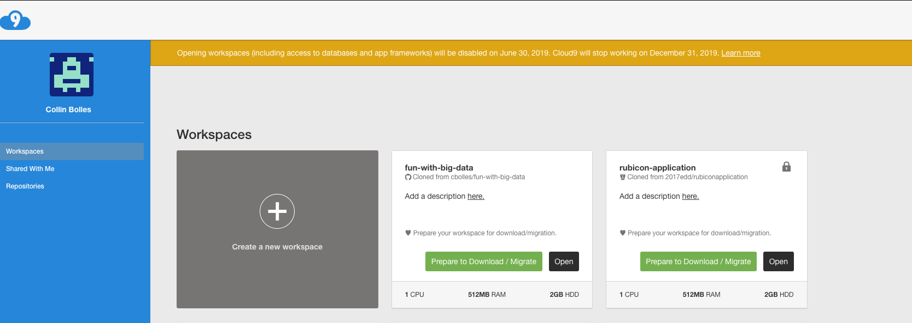
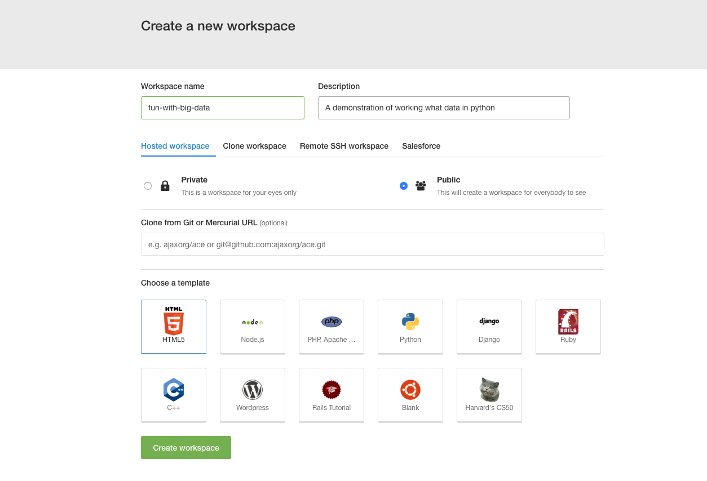
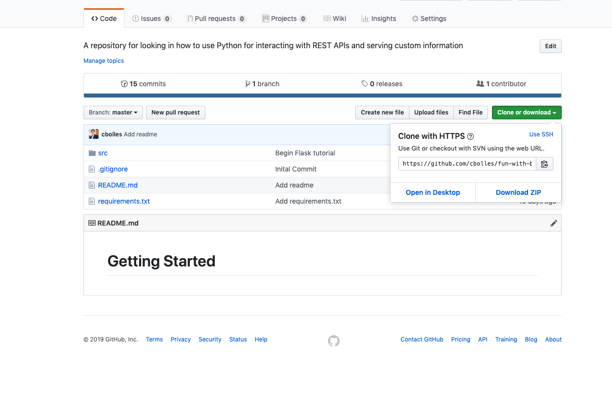
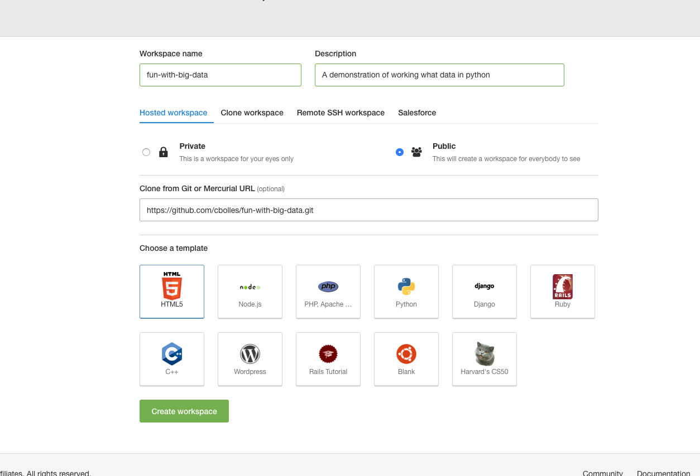
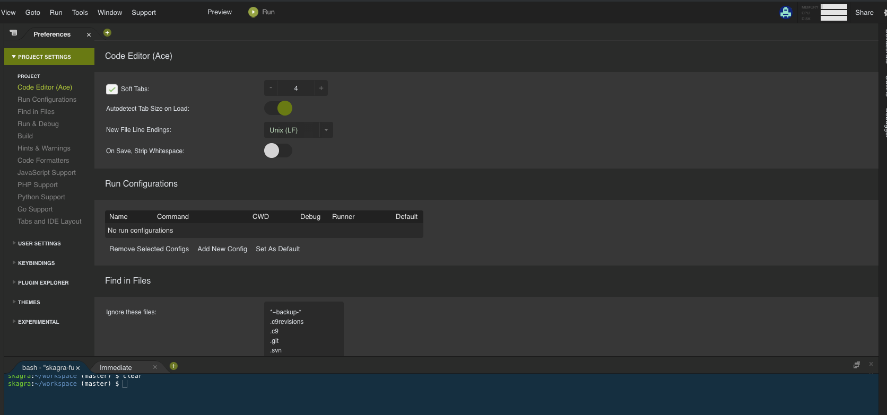
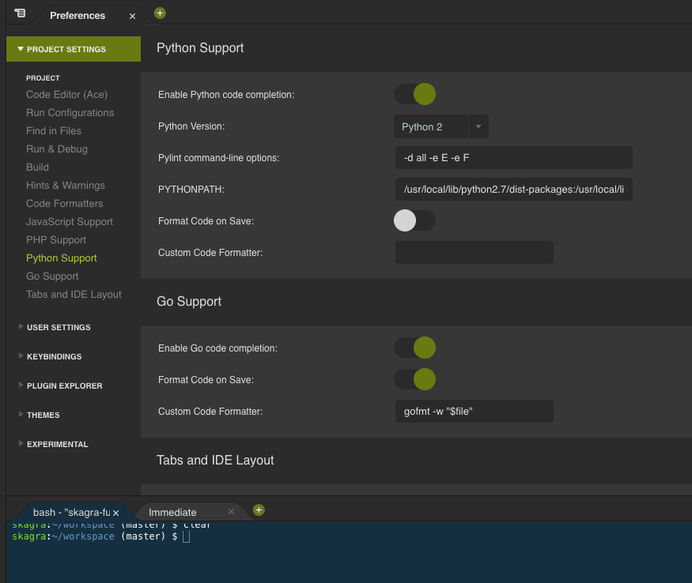
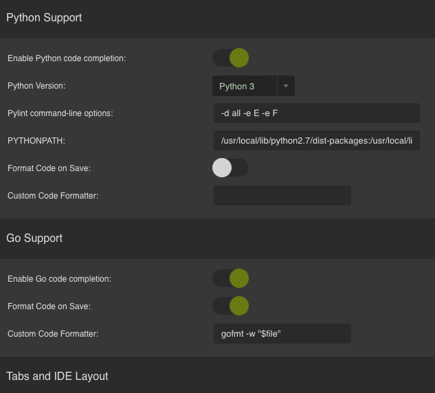
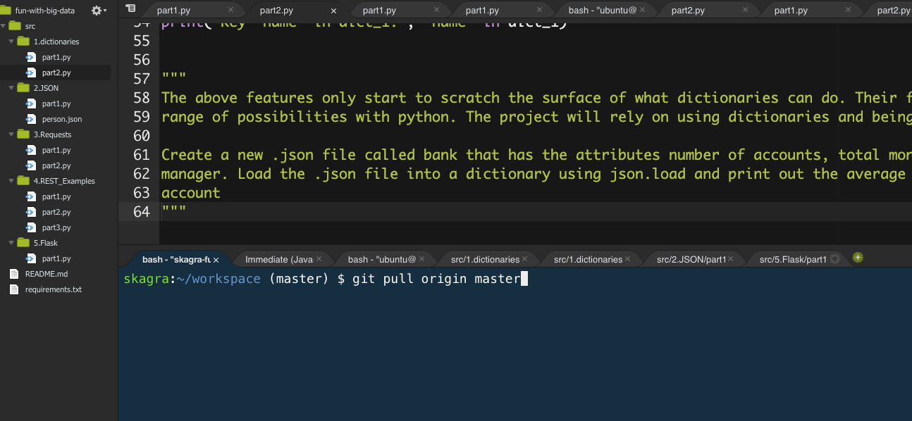

# Getting Started
## Workspace Creation

### 1. Selected create a workspace
Go to c9.io and select "Create a new workspace"

### 2. Name it
Give the workspace a name and description, do not create the workspace yet

### 3. Copy Github URL
From github click on the green "Clone or download" button and copy the URL

### 4. Paste the url
In cloud 9, base the url in the text box titles "Clone from Git or Mercurial URL"

### 5. Create workspace
At this point you can select to create workspace

### 6. Change Default version of python
In cloud 9, click on the gear in the top right corner of the screen

Chose the sub menu "Python Support" on the left hand side

Switch from Python 2 to Python 3 on the "Python Version" drop down menu

### 7. Install requirements
In the terminal at the bottom type in `sudo pip3 install -r requirements.txt`

### 8. Updating
Some times I might make a change and will need you to get the changes, when that happens run `git pull origin master`
in the terminal
